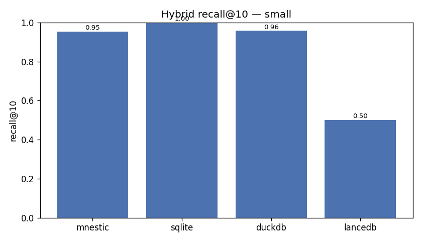
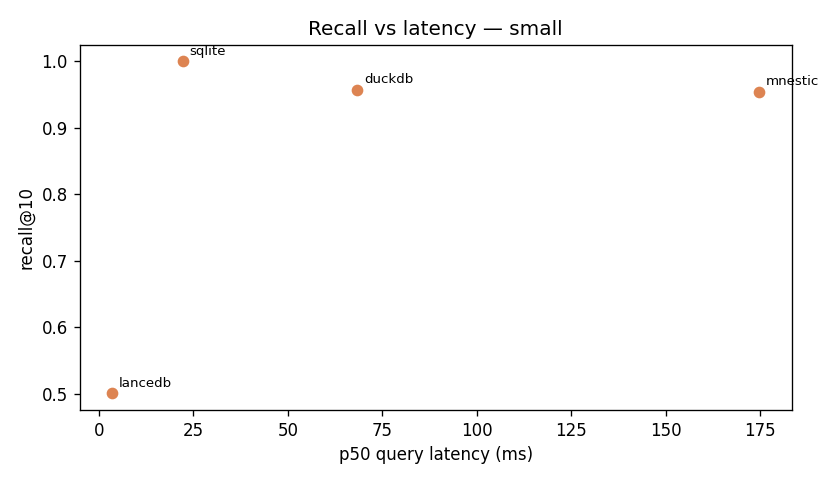

# Benchmark Results

> Auto-generated by `hybrid-recall report`. Numbers are **hardware-specific** and reproducible via the command in [METHODOLOGY.md](METHODOLOGY.md). This file is overwritten on each report run.

## Run

- **scale**: `small` — 40,000 chunks, 10,000 entities, 50,000 edges, dim=384
- **queries**: 1,000 | **k**: 10 | pool_n: 100 | graph_hops: 2 | rrf_k: 60.0
- **embeddings**: synthetic, text-derived | seed: 1234
- **environment**: macOS-26.5-arm64-arm-64bit-Mach-O | Python 3.13.7 | arm
- **generated**: 2026-05-31T03:29:42Z

## Results

| Engine | recall@10 | p50 ms | p95 ms | p99 ms | QPS (1 thr) | build s | ingest rows/s | disk MB | query RSS MB | round-trips |
|---|---|---|---|---|---|---|---|---|---|---|
| **sqlite** 0.1.9 | 1.000 | 22.12 | 26.36 | 40.76 | 44 | 0.07 | 107953 | 71.6 | 212 | 3.0 |
| **duckdb** 1.5.3 | 0.957 | 68.41 | 89.31 | 116.68 | 14 | 2.79 | 180 | 128.0 | 269 | 3.0 |
| **mnestic**  | 0.954 | 174.78 | 227.51 | 258.18 | 5 | 46.03 | 50639 | 417.2 | 140 | 3.0 |
| **lancedb** 0.33.0 | 0.501 | 3.42 | 4.34 | 12.21 | 262 | 8.52 | 28258 | 65.1 | 329 | 2.0 |

_Did not complete:_ `kuzu` (RuntimeError: Kuzu vector/FTS extensions could not be installed — the extension host (extension.kuzudb.com) is offline following Kuzu's October 2025 archival. Kuzu v0.10.0 cannot do vector or full-text search without them. The active continuation is the RyuGraph fork. Underlying error: IO exception: Failed to download extension: vector at URL extension.kuzudb.com/v0.10.0/osx_arm64/vector/libvector.kuzu_extension (ERROR: Could not establish connection))

## Capabilities

| Engine | Vector | Full-text | Graph | Native vec+FTS fusion | Fusion locus | Systems for all 3 signals | Embedded |
|---|---|---|---|---|---|---|---|
| **mnestic** | ✅ | ✅ | ✅ | ✅ | native | 1 | ✅ |
| **sqlite** | ✅ | ✅ | ✅ | ❌ | app-side | 1 | ✅ |
| **duckdb** | ✅ | ✅ | ✅ | ❌ | app-side | 1 | ✅ |
| **lancedb** | ✅ | ✅ | ❌ | ✅ | native | 2 | ✅ |
| **kuzu** | ✅ | ✅ | ✅ | ❌ | app-side | 1 | ✅ |

- **mnestic**: Single embedded engine for vector + full-text + Datalog graph; hybrid_search() fuses vector+FTS in one call; time-travel via Validity.
- **sqlite**: sqlite-vec is a brute-force exact KNN scan (no ANN index); FTS5 for BM25; graph via recursive CTEs; fusion done in application code.
- **duckdb**: VSS HNSW persistence is experimental (hnsw_enable_experimental_persistence); FTS index is a build-time snapshot (PRAGMA create_fts_index) — new rows are not searchable until it is rebuilt; graph via recursive CTEs; app-side fusion.
- **lancedb**: Native vector + full-text with a built-in RRF reranker (single-call hybrid). No graph traversal — the graph signal is unavailable. New rows are immediately searchable (vector + FTS); has version-level snapshots but not record-level time-travel.
- **kuzu**: Embedded graph DB: HNSW vector index + FTS + Cypher variable-length traversal; app-side fusion. Archived Oct 2025 (v0.10.0 final); RyuGraph is the active fork.

## Native single-call fusion

One engine call that fuses signals internally (RRF inside the engine), vs the app-side fusion + separate queries the rest need. `signals` is how many of the three are fused in that one call. Recall here is measured against the **same oracle** as the main table — so when a 3-signal native call matches the decomposed recall@10 at a fraction of the latency, that is the integrated win.

| Engine | signals fused | native recall@10 | p50 ms | p95 ms |
|---|---|---|---|---|
| **mnestic** | 3 | 0.873 | 41.55 | 52.15 |
| **lancedb** | 2 | 0.456 | 1.92 | 2.40 |

## Architecture axes — where integration matters

Beyond raw recall/latency: an agent writes memories continuously, so the store must absorb a new memory and recall it **immediately**, keeping every signal consistent in one system. *Read-your-writes* = the fraction of just-upserted memories a freshly-issued probe finds, per signal — a signal whose index didn't update synchronously can't see the new memory. `n/a` = the engine lacks that signal entirely.

| Engine | Transactional | Time-travel | Incremental index | Systems needed | upsert p50 ms | RYW vector | RYW full-text | RYW graph | **RYW fused** |
|---|---|---|---|---|---|---|---|---|---|
| **mnestic** | ✅ | ✅ | ✅ | 1 | 10.41 | 100% | 100% | 100% | **100%** |
| **sqlite** | ✅ | ❌ | ✅ | 1 | 1.13 | 100% | 100% | 100% | **100%** |
| **duckdb** | ✅ | ❌ | ❌ | 1 | 23.75 | 100% | 0% | 100% | **99%** |
| **lancedb** | ❌ | ❌ | ✅ | 2 | 1.92 | 100% | 100% | n/a | **100%** |

*A low full-text RYW with high vector RYW means the engine's FTS index is a build-time snapshot: new memories are unsearchable by keyword until a rebuild, and the missing signal can drag the new memory out of the fused top-k entirely.*

---
*Recall is measured against an exact NumPy ground truth (full-scan cosine + exact BM25 + exact k-hop BFS, fused with the same canonical RRF). Engines missing a signal lose the recall that signal contributes — this is expected and is the point.*

## Plots

